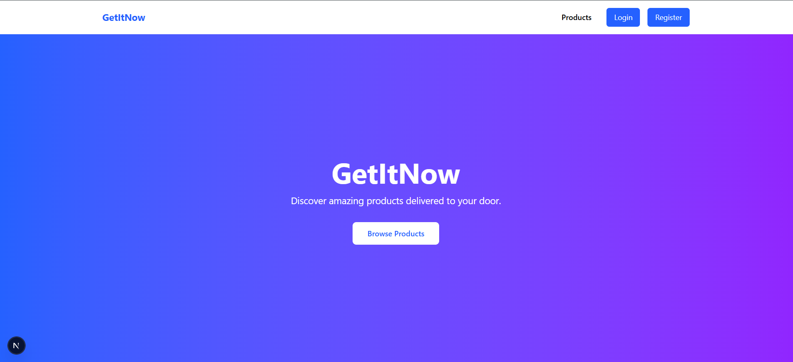
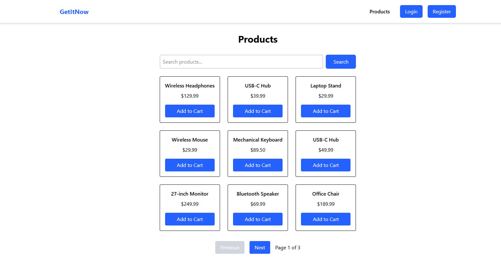
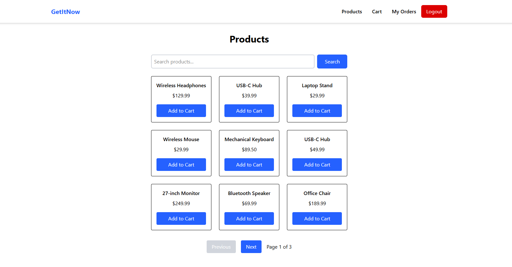
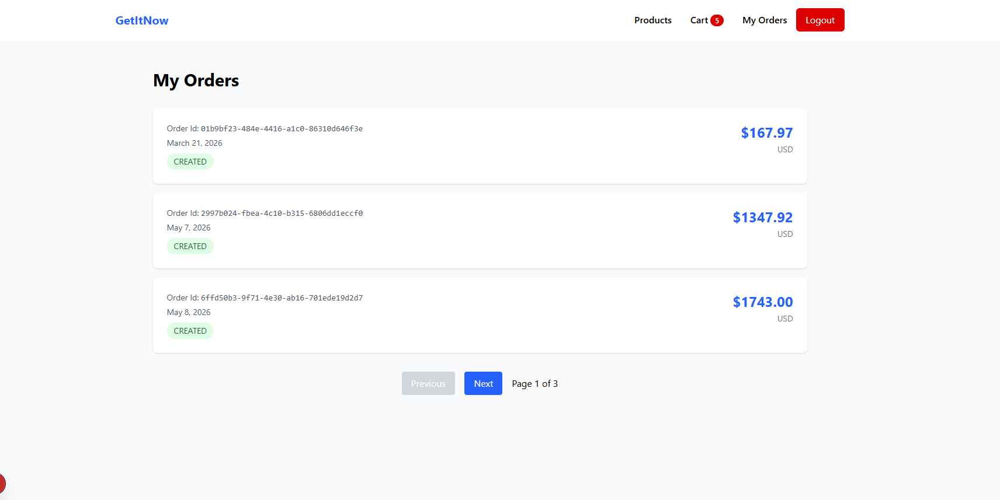
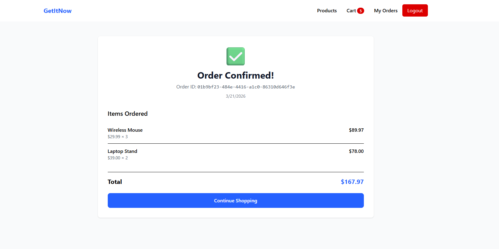

# Full-Stack E-Commerce Platform

A modern, full-stack e-commerce platform with a **Next.js/React** frontend and **Spring Boot** backend. Features secure authentication, shopping cart management, order processing, and a responsive user interface.

**Frontend**: Next.js 16, React 19, TypeScript, Tailwind CSS  
**Backend**: Spring Boot 4.0.3, PostgreSQL, JWT Authentication, Swagger/OpenAPI

## Features

### Frontend (Next.js)
- Modern, responsive UI with Tailwind CSS
- User registration and login with JWT authentication
- Product browsing with search and pagination
- Shopping cart management (add, update quantities, remove items)
- Checkout and order placement
- Order history page with detailed order views
- Dynamic navbar with authentication state
- Client-side routing and navigation

### Backend (Spring Boot)
- RESTful API with comprehensive endpoints
- JWT-based authentication and role-based authorization
- Product management with search and pagination
- Cart management with automatic calculations
- Order processing and checkout workflows
- Database migrations with Flyway
- Swagger/OpenAPI documentation for API testing
- Fully containerized with Docker Compose
- PostgreSQL database with proper relationships

## Tech Stack

### Frontend
- **Next.js 16** - React framework with App Router
- **React 19** - UI library
- **TypeScript** - Type-safe development
- **Tailwind CSS 4** - Utility-first styling
- **React Hooks** - Modern state management

### Backend
- **Java 17** - Programming language
- **Spring Boot 4.0.3** - Application framework
- **Spring Security** - Authentication & authorization
- **PostgreSQL** - Relational database
- **Flyway** - Database migrations
- **Gradle** - Build automation
- **JWT** - Token-based authentication
- **Swagger/OpenAPI** - API documentation

### DevOps
- **Docker Compose** - Container orchestration
- **Git** - Version control

## Project Structure

    .
    ├── frontend/                 # Next.js application
    │   ├── app/                  # App router pages
    │   │   ├── cart/            # Shopping cart page
    │   │   ├── login/           # Login page
    │   │   ├── orders/          # Order history & details
    │   │   │   ├── checkout/   # Checkout processing
    │   │   │   └── [orderId]/  # Order detail page
    │   │   ├── products/        # Product listing with search
    │   │   └── register/        # Registration page
    │   ├── components/          # React components (Navbar, etc.)
    │   ├── contexts/            # React contexts for global state
    │   ├── lib/                 # API utilities and TypeScript types
    │   └── package.json
    │
    ├── src/                     # Spring Boot backend
    │   └── main/
    │       ├── java/com/example/ecommerceplatform/
    │       │   ├── auth/       # Authentication & JWT
    │       │   ├── cart/       # Shopping cart logic
    │       │   ├── catalog/    # Product management
    │       │   ├── order/      # Order processing
    │       │   ├── user/       # User management
    │       │   └── common/     # Shared utilities
    │       └── resources/
    │           ├── db/migration/  # Flyway migrations
    │           └── application.yml
    │
    ├── docker-compose.yml       # Container configuration
    ├── build.gradle             # Backend dependencies
    └── README.md

## Getting Started

### Prerequisites

Make sure you have installed:

- **Docker Desktop** - For running backend containers
- **Java 17+** - For backend development
- **Node.js 18+** - For frontend development
- **npm** - Node package manager
- Gradle (optional if using `./gradlew`)

## Running the Project

### 1. Clone the repository

    git clone <your-repo-url>
    cd ecommerce-platform

### 2. Start the backend with Docker

    docker compose up --build

This starts:
- PostgreSQL database on port 5432
- Spring Boot API on port 8080

### 3. Start the frontend

In a separate terminal:

    cd frontend
    npm install
    npm run dev

The frontend will start on port 3000.

### 4. Access the application

- **Frontend**: `http://localhost:3000` - Main application UI
- **Backend API**: `http://localhost:8080`
- **Swagger UI**: `http://localhost:8080/swagger-ui/index.html` - API documentation

## Docker Setup

The Docker Compose setup includes:

- `postgres` service for PostgreSQL
- `app` service for the Spring Boot backend

Flyway migrations run automatically when the application starts.

## Authentication

This project uses **JWT authentication** for securing protected endpoints.

### Auth Flow

1. User registers or logs in
2. Server validates credentials
3. JWT token is returned
4. Client sends the token in the `Authorization` header for protected requests

Example:

    Authorization: Bearer <your-jwt-token>

## API Documentation

Swagger/OpenAPI is integrated for interactive API testing.

Once the app is running, open:

`http://localhost:8080/swagger-ui/index.html`

With Swagger, you can:

- View available endpoints
- Test requests directly in the browser
- Inspect request and response models
- Authenticate and test protected APIs

## Environment Variables

The application uses environment variables for configuration.

Example values:

    DB_URL=jdbc:postgresql://postgres:5432/ecommerce
    DB_USERNAME=catalog
    DB_PASSWORD=catalog
    JWT_SECRET=your-secret-key
    JWT_EXPIRATION_MS=86400000

## Running Locally Without Docker

If you want to run the application manually instead of through Docker:

### 1. Start PostgreSQL

Make sure a PostgreSQL instance is running and create the required database.

### 2. Configure environment variables

Set database and JWT values in your local environment or `application.properties`.

### 3. Run the app

    ./gradlew bootRun

## Example Workflow

### Using the Web Application

1. Visit `http://localhost:3000`
2. **Register** a new account with email and password
3. **Login** to receive JWT token (stored in browser)
4. **Browse products** - Search and paginate through available items
5. **Add to cart** - Click "Add to Cart" on any product
6. **Manage cart** - Update quantities or remove items
7. **Checkout** - Click "Proceed to Checkout" to place order
8. **View orders** - Access "My Orders" to see order history
9. **Order details** - Click any order to view full details
10. **Logout** - Click logout button in navbar

### Using the API (Swagger)

1. Visit `http://localhost:8080/swagger-ui/index.html`
2. Register/login via `/api/v1/auth` endpoints to receive JWT
3. Click "Authorize" and enter: `Bearer <your-token>`
4. Test any protected endpoint directly from Swagger UI

## Security

- Passwords are securely hashed
- Protected endpoints require JWT authentication
- Authorization can restrict access by role
- Sensitive configuration is handled through environment variables

## Future Improvements

This project is planned to evolve toward a more production-ready e-commerce system. Planned enhancements include:

### Frontend
- Product detail pages with images and descriptions
- Admin dashboard for product management
- User profile page and settings
- Cart item count badge in navbar
- Enhanced error handling and loading states
- Product images and rich descriptions

### Backend & Infrastructure
- Refresh token support for better session management
- Payment gateway integration (Stripe/PayPal)
- Advanced inventory and stock management
- Elasticsearch for advanced product search
- Admin analytics and reporting
- Redis caching for performance
- Message queues for async workflows (order notifications, emails)
- Enhanced test coverage (unit, integration, E2E)

### DevOps
- CI/CD pipeline (GitHub Actions)
- Cloud deployment (AWS/GCP/Azure)
- Monitoring and logging (Prometheus, Grafana)
- Load balancing and scaling strategies

## Learning Goals

This full-stack project was built to practice production-style engineering concepts across the entire stack.

### Frontend Development
- Modern React patterns (hooks, custom hooks, context API)
- TypeScript for type-safe development
- Next.js App Router and client-side routing
- State management and API integration
- Form handling and validation
- Responsive UI design with Tailwind CSS
- User experience and interface design
- Error handling and loading states

### Backend Development
- Secure authentication and authorization with JWT
- RESTful API design and best practices
- Transaction handling and data integrity
- Pagination and efficient data queries
- Database schema design and relationships
- Database migrations with Flyway
- API documentation with Swagger/OpenAPI
- Containerized development with Docker

### Full-Stack Integration
- Frontend-backend communication patterns
- Token-based authentication flow
- Error handling across the stack
- Building complete user workflows
- Designing systems for production scalability

## Screenshots

### Home Page

### Product Listing

### Shopping Cart

### Order History

### Order Confirmation

---

## Author

**Gourav Bhardwaj**
